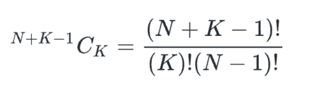

Combinations with repetition:

If we have N elements out of which we want to choose K elements and it is allowed to choose one element more than once, then number of ways are given by:
Combinations with repetition:

